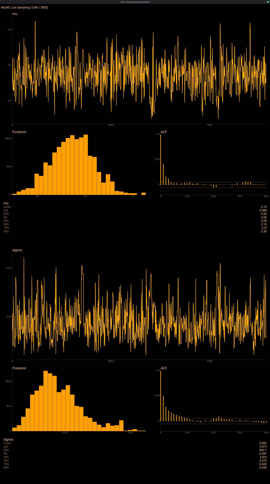

# ExmcViz

**Native diagnostics for Exmc.** ArviZ-style visualization rendered through Scenic on a true-black OLED palette — trace plots, histograms, ACF, pair plots, forest plots, energy diagnostics, and live streaming that updates as the sampler runs.

**With deep respect:** the design draws directly from PyMC and ArviZ conventions. The goal is to preserve the same interpretability and statistical correctness, while changing the rendering substrate to a BEAM-native OpenGL scene graph.



## Why A Native Visualizer?

The PyMC + ArviZ stack is the reference for Bayesian diagnostics. ExmcViz keeps those semantics but renders natively:

- No PNG/SVG round-trips. Every frame is a live scene graph.
- Streaming updates during sampling, not after.
- Resolution-independent rendering that stays sharp on resize and zoom.
- A live posterior state updated online as samples arrive.

## Visualization Types

| Function | What it shows | Window |
|----------|--------------|--------|
| `show/3` | Dashboard: trace, histogram, ACF, summary per variable | Portrait 4K |
| `forest_plot/2` | HDI intervals (50% + 94%) with posterior means | Sized to variable count |
| `pair_plot/2` | k x k grid: histogram diagonal, scatter lower, correlation upper | Square, scaled to k |
| `stream/3` | Live-updating dashboard during active sampling | Portrait 4K |

## Quick Start

```elixir
# After sampling with Exmc
{trace, stats} = Exmc.NUTS.Sampler.sample(ir, init, num_samples: 1000)

# Static dashboard — one row per variable
ExmcViz.show(trace, stats)

# Multi-chain overlay (per-chain colors, R-hat in summary)
{traces, stats_list} = Exmc.NUTS.Sampler.sample_chains(ir, 4, init_values: init)
ExmcViz.show(traces, stats_list)

# Forest plot — HDI intervals at a glance
ExmcViz.forest_plot(trace)

# Pair plot — posterior correlations
ExmcViz.pair_plot(trace)

# Live streaming — watch the sampler work
ExmcViz.stream(ir, init, num_samples: 500)
```

## Architecture

```
ExmcViz.show(trace, stats)
  │
  ├─ Data.Prepare          Nx tensors → plain Elixir lists/maps
  │   ├─ from_trace()      Single chain: samples, ACF, histogram, ESS
  │   ├─ from_chains()     Multi-chain: merge + R-hat
  │   ├─ prepare_energy()  Energy + transition histograms
  │   ├─ prepare_forest()  HDI intervals via narrowest-window algorithm
  │   └─ prepare_pairs()   Pearson correlations, per-variable samples
  │
  ├─ Scene.Dashboard       Scenic scene: lays out components vertically
  │   ├─ TracePlot         Time series with optional divergence markers
  │   ├─ Histogram         Marginal distribution with vertical bin bars
  │   ├─ AcfPlot           Autocorrelation with significance band
  │   ├─ SummaryPanel      Mean, std, quantiles, ESS, R-hat
  │   └─ EnergyPlot        Overlaid marginal + transition energy histograms
  │
  ├─ Scene.Forest          Horizontal HDI bars + mean dots
  │   └─ ForestPlot        Thin line (94%), thick line (50%), white dot
  │
  ├─ Scene.PairPlot        k × k grid scene
  │   ├─ Histogram         Diagonal: marginal distributions
  │   ├─ ScatterPlot       Lower triangle: pairwise samples (≤500 pts)
  │   └─ CorrelationCell   Upper triangle: Pearson r with scaled font
  │
  └─ Scene.LiveDashboard   Same layout as Dashboard, rebuilt on each batch
      └─ Stream.Coordinator   GenServer buffering 10 samples per flush
```

All Nx tensor computation happens in `Data.Prepare`. Components receive plain Elixir lists and floats. This boundary means Scenic never touches Nx, and Nx never touches the scene graph.

## Live Streaming

`ExmcViz.stream/3` connects the sampler directly to the visualization:

1. Opens a Scenic viewport with `LiveDashboard` scene
2. Starts a `StreamCoordinator` GenServer
3. Launches the sampler in a background `Task`
4. Sampler sends `{:exmc_sample, i, point_map, step_stat}` per draw
5. Coordinator buffers 10 samples, then flushes accumulated trace to the scene
6. Scene rebuilds the full graph with updated data
7. Title bar shows progress: `"MCMC Live Sampling (150 / 500)"`

The sampler runs at full speed in its own process. The coordinator’s 10-sample buffer keeps Scenic responsive without throttling the sampler.

## Suggested Screenshots (Placeholders)

Add these images once captured:

- `assets/live_streaming.png` — live dashboard during sampling.
- `assets/pair_plot_4k.png` — pair plot with correlations.
- `assets/forest_plot.png` — forest plot for a multi-variable model.
- `assets/energy_plot.png` — energy marginal + transition overlay.
- `assets/dashboard_4k.png` — full dashboard layout at portrait 4K.

## Color Palette

| Role | RGB | Use |
|------|-----|-----|
| Background | `{0, 0, 0}` | True black (zero OLED power) |
| Default line | `{255, 176, 0}` | Amber trace lines, histogram bars |
| Divergence | `{255, 50, 50}` | Red dots on divergent samples |
| Energy transition | `{80, 140, 220}` | Blue overlay on energy plot |
| Forest HDI thin | `{140, 110, 60}` | 94% interval (dim amber) |
| Forest HDI thick | `{255, 176, 0}` | 50% interval (bright amber) |
| Forest mean | `{255, 255, 255}` | White dot |
| Text | `{255, 200, 120}` | Labels, titles |

## Dependencies

```elixir
{:exmc, path: "../exmc"},
{:scenic, path: "../../scenic", override: true},
{:scenic_driver_local, git: "https://github.com/ScenicFramework/scenic_driver_local.git"}
```

## Test Suite

34 tests covering data preparation (histograms, ACF, ESS, HDI, correlations, energy), linear scaling, and multi-chain merge logic. All visualization is tested through the `Data.Prepare` layer — components are pure Scenic graph builders with no state to test.


## License

ExmcViz is licensed under the GNU Affero General Public License v3.0 (AGPL-3.0).

You are free to use, modify, and distribute this software under AGPL terms. If you run a modified version as a network service, you must make your source code available to users of that service.

Commercial licensing is available for organizations that need to embed ExmcViz in proprietary products without AGPL obligations. Contact us for terms.

## Companion: Exmc

See `exmc/` for the probabilistic programming framework that produces the traces ExmcViz visualizes.
